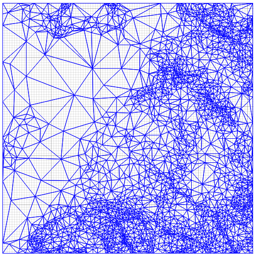

# delatin-rs

Simple and fast [**TIN**](https://en.wikipedia.org/wiki/Triangulated_irregular_network) generation library, written in Rust. Uses [Delaunay triangulation](https://en.wikipedia.org/wiki/Delaunay_triangulation).



Delatin is a port of Volodymyr Agafonkin's [*delatin*](https://github.com/mapbox/delatin) (JavaScript) and Michael Fogleman's [*hmm*](https://github.com/fogleman/hmm) (C++), which is in turn based on the paper [Fast Polygonal Approximation of Terrains and Height Fields (1995)](http://mgarland.org/files/papers/scape.pdf) by Michael Garland and Paul Heckbert.

## Example

```rust
use delatin::triangulate;

let heights = vec![100.1, 123.4, 111.5, 121.4];
let width = 2;
let height = 2;
let max_error = 1.0;
// triangles is a vector of tuples containing three indices to original height data 
// every tuple forms a triangle
let triangles = triangulate(&heights, width, height, max_error)?;
```

## Installation

```bash
cargo add delatin
```

## Plot triangulation result

Align your data in plot/src/main.rs and run:

```bash
cargo run --bin plot
```

## Benchmark test

```bash
cargo run --bin test --release
```

## TODO
- Add tests
- Add benchmarks
- Add more comments and docs